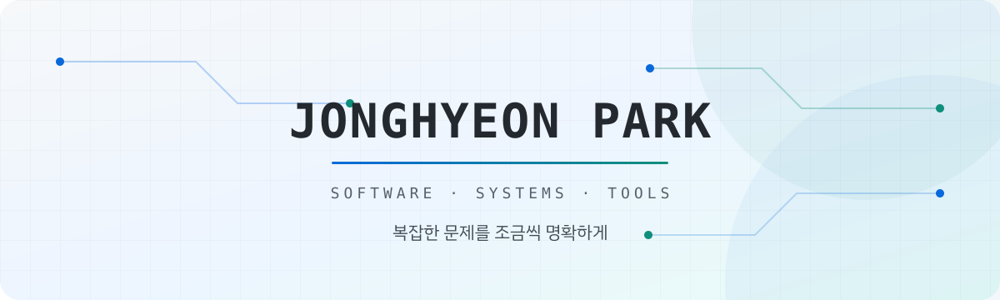

<picture>
  <source media="(prefers-color-scheme: dark)" srcset="./assets/banner-dark.svg">
  <source media="(prefers-color-scheme: light)" srcset="./assets/banner-light.svg">
  
</picture>

  자주 틀리고, 모르는 것도 많습니다. 
  상태와 실패가 드러나는 시스템을 추구합니다. 
  기억이나 감에 맡기기보다 약속을 이행합니다.

## Selected work

<table>
  <tr>
    <td width="50%" valign="top">
      <h3>Multi-chain issuance control</h3>
      
12개 저장소로 나뉜 멀티체인 스테이블코인 발행·상환 플랫폼. 서명 권한과 실행 주체를 분리하고, 온·오프체인에 걸친 재시도·중복 실행·체인 간 상태 정합성을 다뤘습니다.

      
<a href="https://github.com/zezeg2/minting-platform-portfolio"><strong>View repository →</strong></a>

      
<code>12 repos</code> <code>Idempotency</code> <code>Trust boundaries</code> <code>Audit</code>

    </td>
    <td width="50%" valign="top">
      <h3>Proof-of-solvency engine</h3>
      
단일 거래소용 ZK 회로를 여러 모델이 공존하는 엔진으로 일반화. 입출력 추상화, 회로 계산량 최대 60% 절감, GPU 백엔드 통합으로 증명 생성을 5배 이상 가속.

      
<a href="https://github.com/zezeg2/solvency-proof-engine-portfolio"><strong>View repository →</strong></a>

      
<code>ZK proving</code> <code>Circuit design</code> <code>OSS adaptation</code>

    </td>
  </tr>
  <tr>
    <td width="50%" valign="top">
      <h3>AI-Support</h3>
      
LLM 호출을 Java 함수로 정의하고, 응답을 사용자 정의 타입으로 반환하는 Spring Boot 라이브러리. 동기·리액티브 실행, 검증 체인, local/Redis/Mongo 대화 컨텍스트를 지원하며 Maven Central에 2.1.4까지 배포했습니다.

      
<a href="https://github.com/zezeg2/ai-support"><strong>View repository →</strong></a>

      
<code>Java</code> <code>Spring Boot</code> <code>Reactive</code> <code>Maven Central</code>

    </td>
    <td width="50%" valign="top">
      <h3>Agent-driven project template</h3>
      
에이전트가 미결정 사항을 임의로 정하거나 검증 없이 끝내지 않도록, 컨텍스트·결정 게이트·핸드오프·검증 규칙을 정리한 프로젝트 템플릿.

      
<a href="https://github.com/zezeg2/methodology-template"><strong>View repository →</strong></a>

      
<code>Decision gates</code> <code>Handoff</code> <code>Vectors-first</code> <code>Validation</code>

    </td>
  </tr>
</table>

## Building with

  

<picture>
  <source media="(prefers-color-scheme: dark)" srcset="./assets/footer-dark.svg">
  <source media="(prefers-color-scheme: light)" srcset="./assets/footer-light.svg">
  
</picture>
